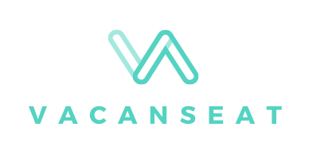
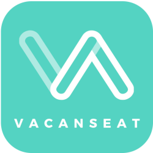

##### Vacanseat

  

* イマスグ空いているお店が見たいユーザーの方は[コチラ](#お客さんの使い方)
* 空席情報をいち早くお客さんに伝えたいオーナーの方は[コチラ](#オーナーの使い方)
* こんなサイコーなアプリを作った私たちやアプリのテックに興味がある方は[コチラ](#テックについて)

## お客さんの使い方

### どんなアプリ？

Vacanseat はイマスグ空いているお店を探したいアナタのためのアプリで、近くで空いているお店(カフェ、レストラン、バー)をその場で検索、予約ができるアプリです！

## オーナーの使い方

### どんなアプリ？

Vacanseat はお客さんに現在の空席情報を伝えることができ、安全に予約を受け付けることもできるアプリです！

### 気になったそこのアナタ！Google Play StoreでイマスグVacanseatをダウンロード！ 

## テックについて

### アプリの作成者(Github リンク)
#### Yoshinori Wakabayashi [@Bayezid1989](https://github.com/Bayezid1989)  
#### Naoto Maeda [@naoto-1119](https://github.com/naoto-1119)  
#### Alexander Stevenson [@AVStevenson](https://github.com/AVStevenson)  
#### Ryusei Takezono [@ryu-take](https://github.com/ryu-take)  
A