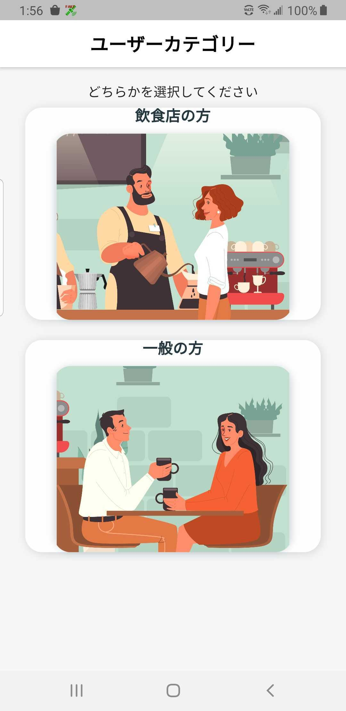
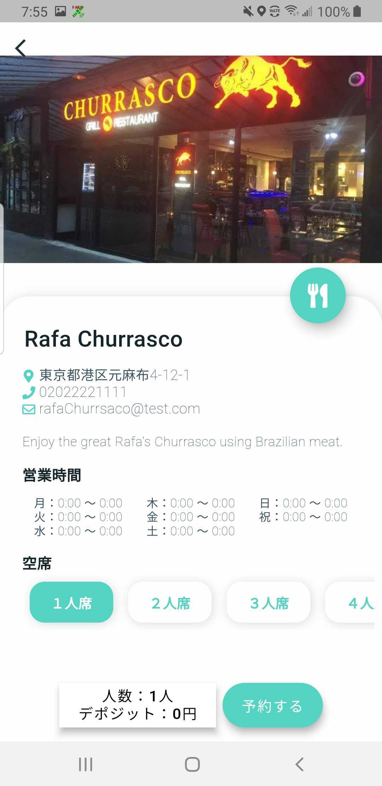
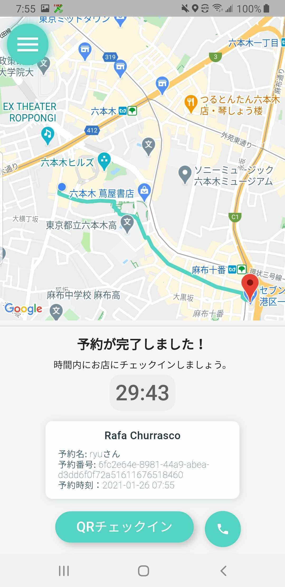
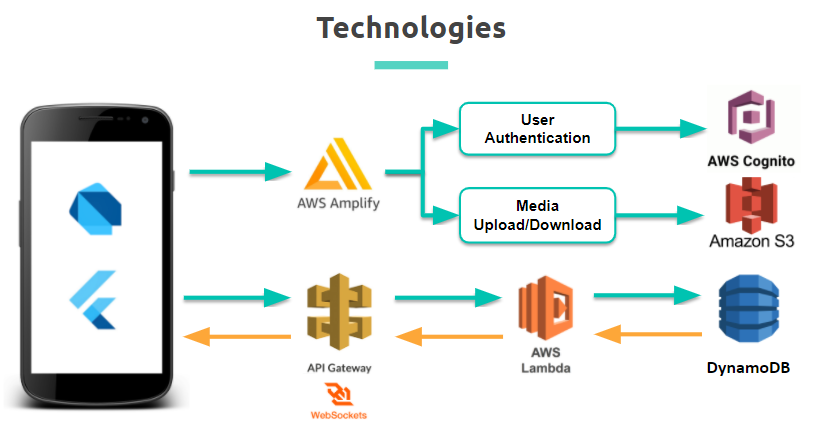

# VACANSEAT日本語README

  

* 今スグ空いているお店が見たい方は[コチラ](#ユーザーのアナタ)
* 空席情報をいち早くお客さんに伝えたいオーナーの方は[コチラ](#オーナーのアナタ)
* こんなサイコーなアプリを作った私たちやアプリのテックに興味がある方は[コチラ](#テックについて)

* とりあえずダウンロードして使ってみたい方は[コチラ](https://play.google.com/store/apps/details?id=com.yarn.vacanseat)(Android 限定)

# ユーザーのアナタ

## どんなアプリなの？

VACANSEAT は**今**!空いているお店を探したいアナタのためのアプリです:iphone:    
このアプリの特徴を簡単に伝えるとしたら*近くの空いているお店(カフェ、レストラン、バー)をその場で簡単に検索、予約ができるアプリ*になっています!

## ユーザーのアプリの使い方
 
### サインアップ

まずはサインアップをしていただきます。 サインアップが完了している方は[マップページ](#マップページ)

ログイン画面で**新規登録ボタン**を押していただき、その後メールアドレスとパスワードを入力して、完了したら新規登録!

次に確認コード入力画面に移ります。ここでは先ほど登録していただいたメールアドレス宛に届いた6ケタの確認コードを入力していただきます。

正常に入力が完了したら、次はユーザーカテゴリー選択画面に移ります。アナタはユーザーなので**一般の方**を選択してください。

サインアップ完了!:tada:

### ログイン

サインアップで登録したメールアドレスとパスワードを入力してログイン:key:

 

 &nbsp;&nbsp;&nbsp;
 &nbsp;&nbsp;&nbsp;

 &nbsp;&nbsp;&nbsp;

 

### マップページ

ユーザーのメインページです:world_map:マップにあるピンが現在空いているお店です。画面下側にあるリストをスワイプすることでもお店を探すことができます

さらに、**条件を絞る**ボタンを押すことで、アナタの求めているお店でフィルタリングすることができます！  
* フィルタリング項目:mag_right:
  * グループの人数
  * お店のカテゴリー
  * 現在位置からの距離

 

 &nbsp;&nbsp;&nbsp;
 

 

### お店の詳細

マップページのピン上部に現れるウィンドウまたは写真のリストをタップすることでそのお店の詳細ページを見ることができます

もしそのお店を予約したいなら、人数を設定して**予約する**ボタンをタップ！

予約に必要な名前を入力し、デポジット金額を確認したら**予約**ボタンをタップし、支払い情報(クレジットカードのみ)を入力:pencil:

 

 &nbsp;&nbsp;&nbsp;

 

### タイマーページ

支払いが完了すると、タイマーページに移ります。このページには予約が完了した位置からお店までのルートを示したマップと予約の詳細な情報、30分のタイマーが表示されます。
更にアナタが登録したメールアドレスに予約情報が記載されたメールが届きます:email:

:warning:もし予約が完了して30分以内にお店に着くことができなかった場合、お店は予約をキャンセルすることができ、**キャンセルされた場合デポジットは返ってきません**。

#### お店に着いた

ご利用ありがとうございます!Enjoy!

# オーナーのアナタ

## どんなアプリなの？

VACANSEAT はお客さんに現在の空席情報を伝えることができ、安全に予約を受け付けることもできるアプリです！

## オーナーのアプリの使い方

基本的な[サインアップ](#サインアップ)はユーザーと同じです

<!--### お店の基本情報--->
:construction:鋭意作成中!しばしお待ちください:construction:

### このアプリが気になったそこのアナタ！Google Play Storeで今スグ**VACANSEAT**をダウンロード！ 

# テックについて

## テックスタック:robot:

 

 

### アプリの作成者(Github リンク)
#### Yoshinori Wakabayashi [@Bayezid1989](https://github.com/Bayezid1989)  
#### Naoto Maeda [@naoto-1119](https://github.com/naoto-1119)  
#### Alexander Stevenson [@AVStevenson](https://github.com/AVStevenson)  
#### Ryusei Takezono [@ryu-take](https://github.com/ryu-take)  
