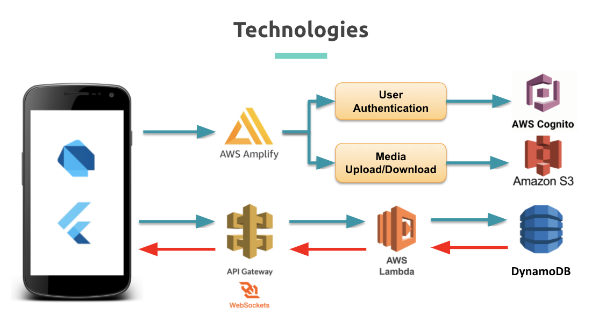

*This repository was created during our time as students at Code Chrysalis.
 

<<<<<<< HEAD

## Introduction
=======

 
<h1 align="center">Vacanseat</h1>

<strong>Mobile application to find and book real time vacant seat among cafes, restaurants, and bars.</strong>

 

## 1. Introduction
--- 
>>>>>>> 8b04a932f04772c9a7b0d8b532314086df8d7c0a

VacanSeat is designed to connect venues (restaurants/bars/cafes) that have immediate capacity with patrons for impromptu bookings.

Walking door to door with a group of people or calling venues found using simple search methods on a smartphone, requires a lot of effort and produces arbitrary results. With VacantSeat users are presented with a range of available options within their direct vicinity that they can filter based upon meaningful requirements such as distance, venue type and most important of all party size.

Merchants are supplied with a new sales channel, useful whether the restaurant is unexpectedly empty or when they simply wish to maximise occupancy. The signup is simple and the system itself is designed to easily integrate with their existing booking management system.

<<<<<<< HEAD
## Tech/Framework

=======
## 2. Technology / Framework
---

 

 

>>>>>>> 8b04a932f04772c9a7b0d8b532314086df8d7c0a

The application uses a variety of technologies described below with relevant links.

### *Front End*

The front end application was developed using [Dart](https://dart.dev/) Language and the [Flutter](https://flutter.dev/) framework. 
For more information on the various third party packages used: [third party packages for dart/flutter](https://pub.dev/)

### *Back end*

[Amazon Amplify](https://aws.amazon.com/getting-started/hands-on/build-flutter-app-amplify/) was used to provide a serverless backend via [Amazon DynamoDB](https://aws.amazon.com/dynamodb/), [Amazon API Gateway](https://aws.amazon.com/api-gateway/), and [AWS Lambda](https://aws.amazon.com/lambda/). Using Amplify meant that other AWS features could be accessed such as [S3](https://aws.amazon.com/s3/) for photo storage and [Cognito](https://aws.amazon.com/cognito/) for user signup and login. [Websockets](https://docs.aws.amazon.com/apigateway/latest/developerguide/apigateway-websocket-api.html) is used to send & receive real time data to-from the database.

<<<<<<< HEAD
Amazon Amplify was used to provide a serverless backend via DynamoDB and AWS Lambda. Using Amplify meant that other AWS features could be accessed such as S3 for photo storage and Cognito for user signup and login.
=======
### *API*

The application utilises the [Google Map API](https://developers.google.com/maps) to show the map with current location and routes to distanation. Also, the [Stripe API](https://stripe.com/docs/api) is integrated for payments from customers to merchants via Stripe Connect.
>>>>>>> 8b04a932f04772c9a7b0d8b532314086df8d7c0a

## 2. User Guide
---

**1) User Sign Up**

<<<<<<< HEAD
The application utilises the google map and routes APIs and the Stripe API for payments from customers to merchants via Stripe Connect.
=======

## Reference
---
>>>>>>> 8b04a932f04772c9a7b0d8b532314086df8d7c0a

## Full Readme and user guide:

[Google Doc: guide](https://docs.google.com/document/d/e/2PACX-1vS0WvzoeL5ZO3_fzA-xoLMnxKF0Jw0ILtEL_HUCFwdBOIwSOAh8n9Rx_J8d1FDiIAiNdDUGEhvIyV5X/pub)
