
*This repository was created during our time as students at Code Chrysalis.
 

Thank you very much for coming to see our repository. We spent a month to create our app to solve real world problem in Tokyo. I hope you enjoy exploring here and our app.
 
 

 
<h1 align="center">VACANSEAT</h1>

<strong>Mobile application to find and book real time vacant seat among cafes, restaurants, and bars.</strong>

 

## 0. Index
---
* [Introduction](#1.-Introduction)
* [Technology](#2.-Technology-/-Framework)
* [User Guide](#3.-User-Guide)
* [Authors](#4.-Authors)

## 1. Introduction
--- 

VACANSEAT is designed to connect venues (restaurants/bars/cafes) that have immediate capacity with patrons for impromptu bookings.

Walking door to door with a group of people or calling venues found using simple search methods on a smartphone, requires a lot of effort and produces arbitrary results.  With VACANSEAT users are presented with a range of available options within their direct vicinity that they can filter based upon meaningful requirements such as distance, venue type and most important of all party size.

Merchants are supplied with a new sales channel, useful whether the restaurant is unexpectedly empty or when they simply wish to maximise occupancy.  The signup is simple and the system itself is designed to easily integrate with their existing booking management system.

## 2. Technology / Framework
---

 

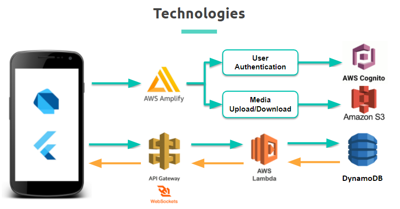
 

The application uses a variety of technologies described below with relevant links.

### *Front End*

The front end application was developed using [Dart](https://dart.dev/) Language and the [Flutter](https://flutter.dev/) framework. 

### *Back end*

[Amazon Amplify](https://aws.amazon.com/getting-started/hands-on/build-flutter-app-amplify/) was used to provide a serverless backend via [Amazon DynamoDB](https://aws.amazon.com/dynamodb/), [Amazon API Gateway](https://aws.amazon.com/api-gateway/), and [AWS Lambda](https://aws.amazon.com/lambda/). Using Amplify meant that other AWS features could be accessed such as [S3](https://aws.amazon.com/s3/) for photo storage and [Cognito](https://aws.amazon.com/cognito/) for user signup and login. [Websockets](https://docs.aws.amazon.com/apigateway/latest/developerguide/apigateway-websocket-api.html) is used to send & receive real time data to-from the database.

### *API*

The application utilises the [Google Map API](https://developers.google.com/maps) to show the map with current location and routes to distanation. Also, the [Stripe API](https://stripe.com/docs/api) is integrated for payments from customers to merchants via Stripe Connect.

⚠️ Currently Stripe Connect account is in test mode, so the real transaction will not happen through Vacanseat.

## 3. User Guide
---

**1) User Sign Up**

When a user first loads the app they are greeted with a login/signup page that is Identical for merchants and customers.

In order to create an account within VACANSEAT users will need an Email address to verify their registration and for the purposes of password recovery.

During the signup process the user will be asked to indicate whether they are initialising a “Merchant” or “Customer” account.

 

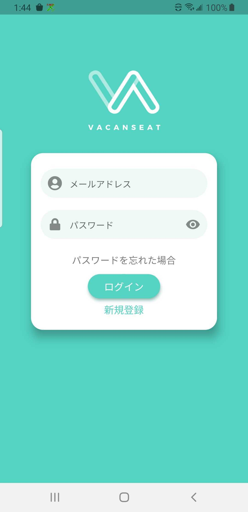 &nbsp;&nbsp;&nbsp;
 &nbsp;&nbsp;&nbsp;
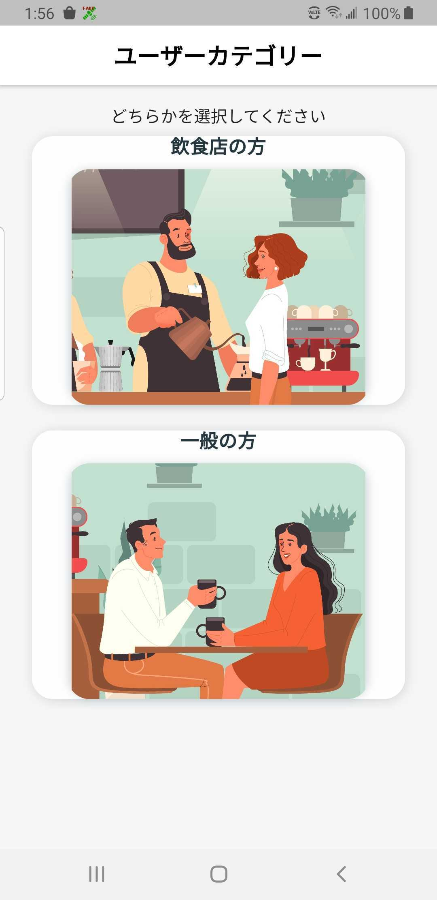
 &nbsp;&nbsp;&nbsp;

 

*For Merchants*
 Merchant sign up requires additional details relating to their establishment, its location, contact details and other relevant information. Merchant's can also setup a Stripe account through the Menu once logged in.

**2) Customer Flow**

### *A) Finding Vacant Seats* 🔎

Upon entry to the application as a customer, the user is presented with a map view displaying participating restaurants within range.   There are a selection of filter options that can be accessed via the button at the bottom of the page. Filters include party size, distance and venue type.

Available venues on the map can be directly inspected by tapping upon them or by scrolling through the gallery feature in the bottom portion of the display.

 

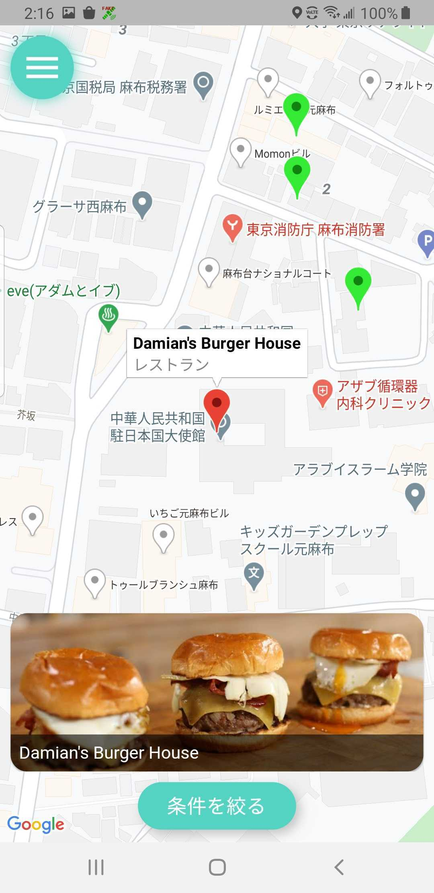 &nbsp;&nbsp;&nbsp;
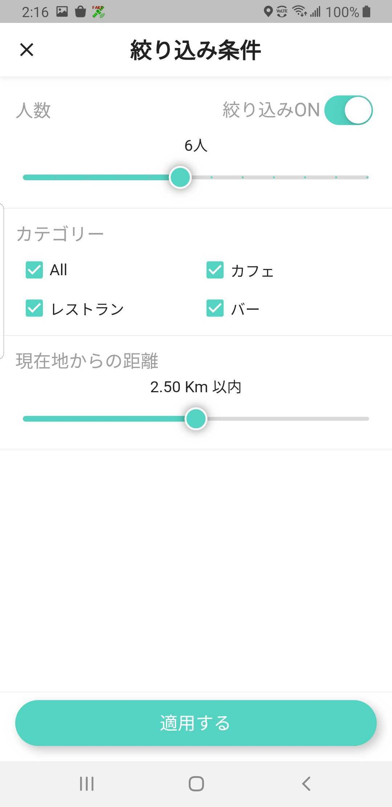 

 

### *B) Booking Vacant Seats* ✅ 
Tapping on the information bubble above a pin or directly upon the photo in the gallery will take the user through to the venue detail page where the user is able to inspect further information relating to the venue and make a booking if desired.

In order to complete a booking the user must select (tap) one of the listed vacant seat and enter a reservation name. If there is a seating deposit specified the user is prompted to make a one time payment via credit card.

 

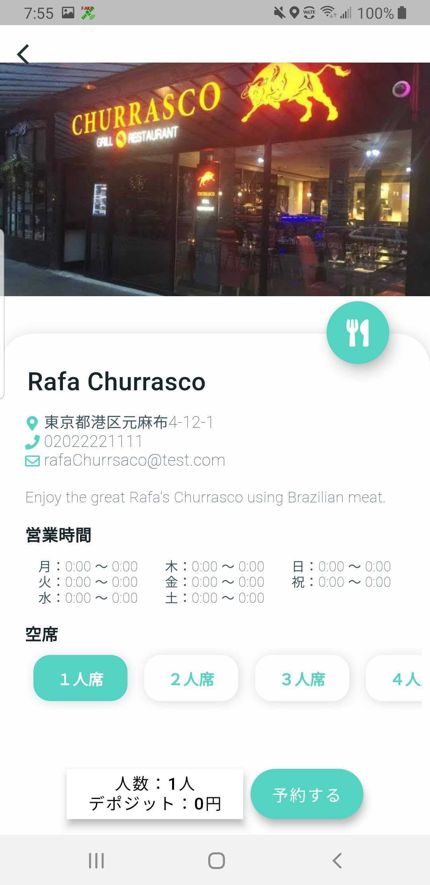 &nbsp;&nbsp;&nbsp;
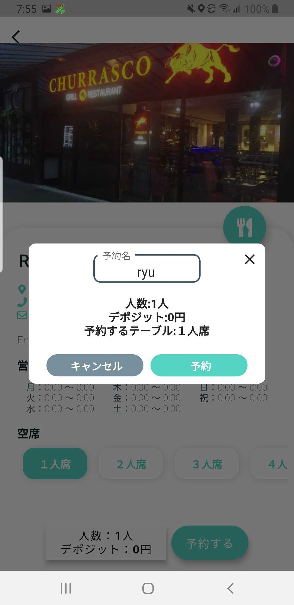

 

### *C) Go to Venue* 🏃‍♂️⏳
After the booking process is complete the user is taken to a timer page. Additionally, an email receipt related to the booking is sent to the users registered email address for reference.

The timer page contains:  

- A map with a route to the selected venue.
- ⚠️ A countdown timer of 30 minutes. 
- A QR code Scanning function for Check In at the venue.
Phone contacts of the venue

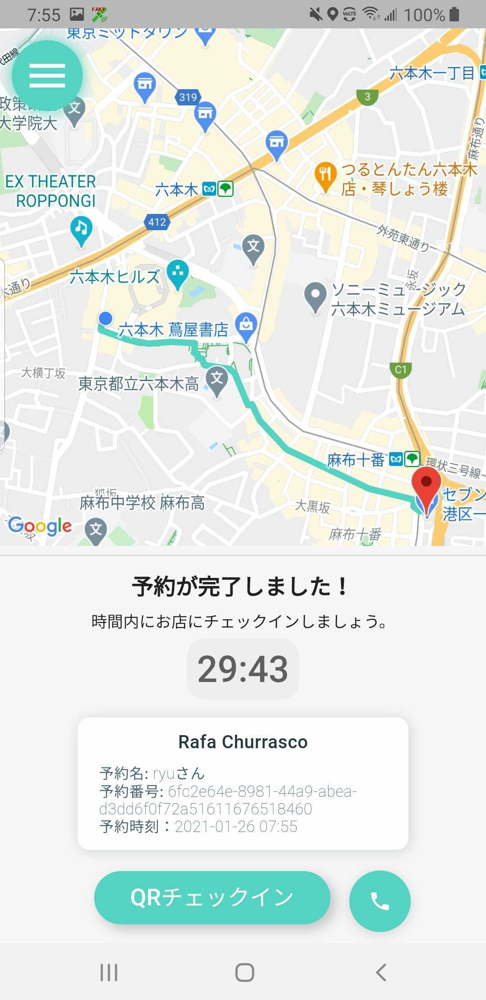

⚠️ If customer do not check-in at the venue by the 30 minutes time frame, venues can cancel reservation and deposit will not return to the customer

 

**3) Merchant flow**

### *A) Control Vacancy Status* 🕹️
When a user enters the application from a merchant account they are greeted with the main control panel. From here they can make available various table configurations for customers to book. If they should desire they can assign a deposit fee related to that table.

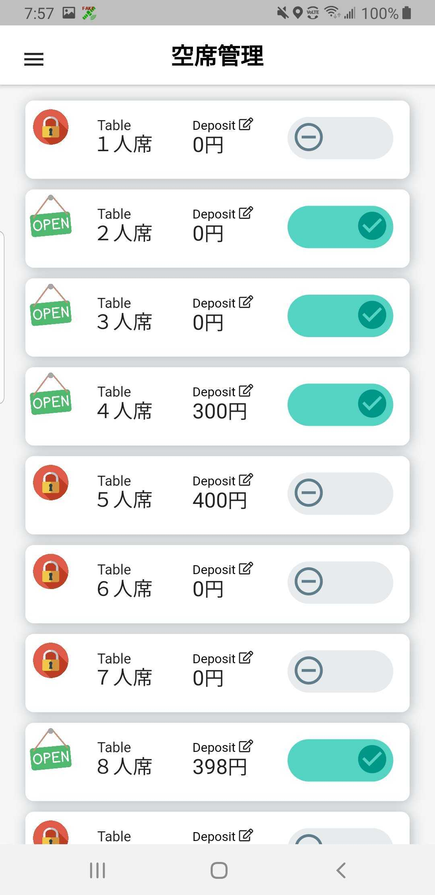

 

### *B) Receive Booking Notification* ⚙️ 

When a customer makes a booking at the store the merchant is sent a notification and the relevant seating configuration is toggled off. The merchant is prompted to review the reservation and must make a decision based upon their own circumstances as to whether to manually reoffer the seating configuration to the app again.

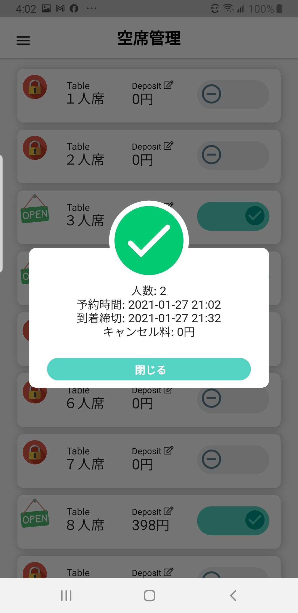

 

### *C) Open Menu* ⚙️ 

The settings page has a sliding drawer style menu giving access to other important pages such as store details, booking history, stripe payment registration and the QR code check in page.

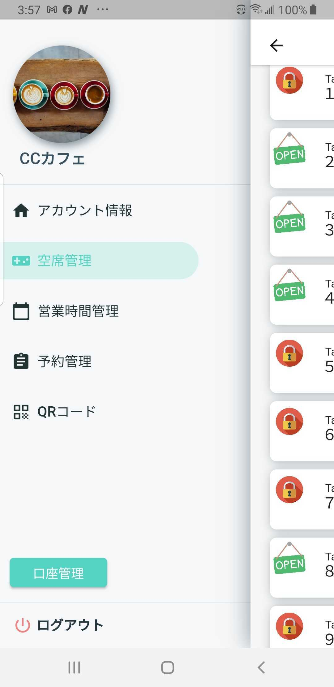

 

### *D) Checkin Customers* ⚙️ 

Once the customer has arrived at the location the Merchant can manually check the user in by clicking the button on the booking transaction page. Alternatively, they can require the customer to scan either the QR code within the application or a QR code placed conveniently with the store.

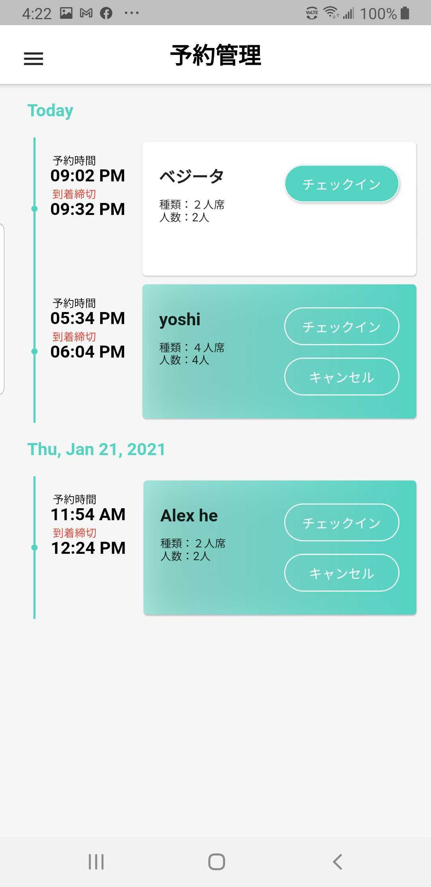 &nbsp;&nbsp;&nbsp;
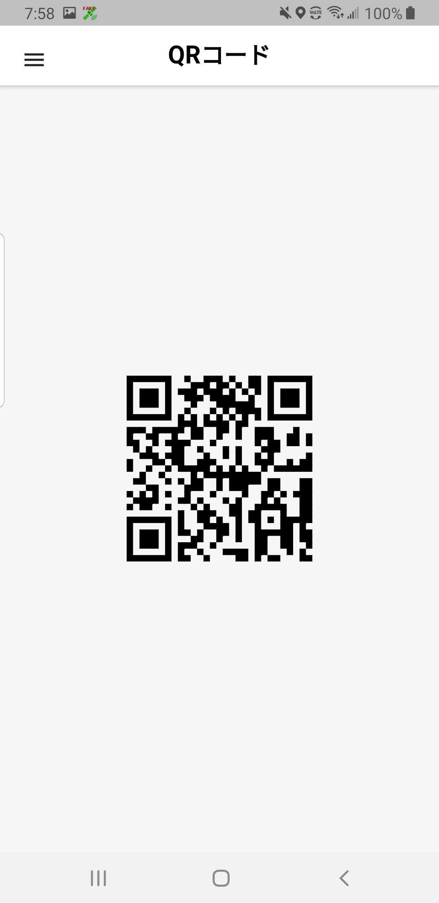

 

## 4. Authors
---

VACANSEAT was developed by Code Chrysalis cohort 16 graduates,  
 

### TEAM YARN:

#### Yoshinori Wakabayashi [@Bayezid1989](https://github.com/Bayezid1989)  
#### Naoto Maeda [@naoto-1119](https://github.com/naoto-1119)  
#### Alexander Stevenson [@AVStevenson](https://github.com/AVStevenson)  
#### Ryusei Takezono [@ryu-take](https://github.com/ryu-take)  

 

## 5. Acknowledgments:
---
We are indebted to the genuine support and insighful advice by...

#### R.Viana

#### E.Kidera,

#### Y.Yamada,

#### T.Kondo.

 

## 6. License
---
- MIT
